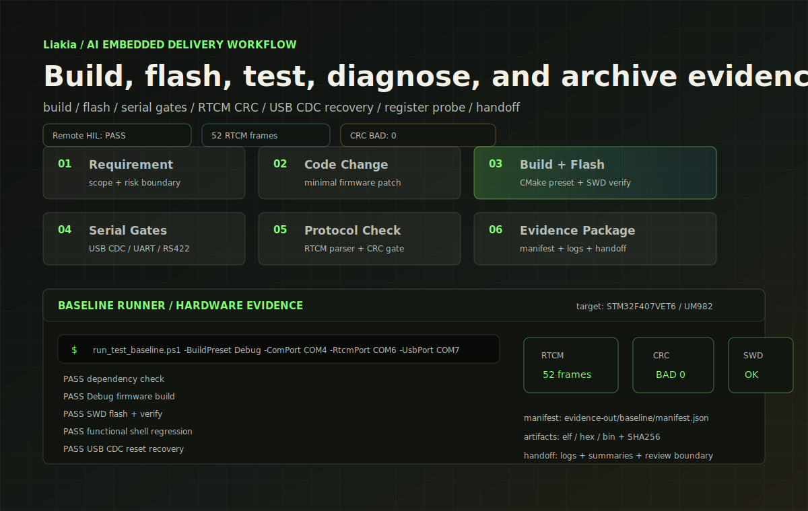

# Liakia

**AI-Native Embedded Delivery Workflow Demo**

[中文说明](README.zh-CN.md) | English

[](https://www.st.com)
[](https://www.unicorecomm.com)
[](https://www.rtcm.org)
[]()
[]()

[](https://sailiono.github.io/liakia-ai-embedded-workflow/promo-demo/index.en.html)

Liakia is a public showcase for a **human-in-the-loop AI workflow for embedded firmware delivery**.

It uses **dpiny-RTK**, a real STM32F407 + UM982 RTK base-station firmware, as the first hardware case. The main value is the surrounding delivery loop:

```text
requirement -> code change -> build -> flash -> serial tests
-> protocol gates -> register probe -> evidence package -> handoff
```

**dpiny-RTK is the demo case. Liakia is the workflow.**

Use this README as a guided front page. It first explains what Liakia is, then routes you into the right demo path.

## What Liakia Does

Liakia is not a firmware library and not a single RTK product. It is a workflow pattern for turning embedded firmware work into a repeatable delivery loop:

```text
build the firmware
flash the target
run hardware-facing tests
capture protocol and register evidence
generate a handoff package
keep AI suggestions under human review
```

The repository contains two complementary ways to understand that workflow:

- a **professional engineering case**, based on the real dpiny-RTK STM32F407 + UM982 firmware;
- a **hands-on starter lab**, based on a low-cost STM32F103C8T6 + BMP280 bench that readers can wire and debug themselves.

## What This Repo Proves

| Area | What is included |
|---|---|
| Reference firmware | STM32F407 + FreeRTOS firmware for a UM982 RTK base-station controller |
| Delivery workflow | CMake build, SWD flash, serial tests, RTCM CRC gate, USB CDC reset gate, register probe, evidence manifest |
| Hardware evidence | Redacted local bench and remote hardware-in-the-loop evidence packages |
| AI model | AI assists implementation, log analysis, test generation, and report drafting; engineers keep final review authority |
| Reuse target | STM32 board bringup, firmware regression, remote bench validation, and customer issue reproduction |

## Why The Starter Lab Exists

The dpiny-RTK case proves that the workflow can operate on a real firmware project with bench evidence. That is useful for engineers, but it is not the easiest first contact for a new reader.

The STM32F103 starter lab exists for a different reason: it lets someone build a small bench, inject a realistic known-bad application bug, observe a failing gate, generate diagnosis material, and then fix the issue with the same evidence-first method. It is intentionally not a prebuilt firmware image. The learning value is in wiring the board, generating the IOC, integrating the application layer, and seeing the loop fail and recover on real hardware.

Use the starter lab if you want to feel the workflow. Use the engineering case if you want to audit the stronger production-like evidence.

## Choose Your Path

| Path | Best for | Start here |
|---|---|---|
| Hands-on Starter Lab | New users who want to wire a real STM32F103C8T6 board and debug a known-bad sensor application | [starter-kits/stm32f103-sensor-lab/quick-start.md](starter-kits/stm32f103-sensor-lab/quick-start.md) |
| Engineering Case | Embedded engineers who want to inspect the real STM32F407 + RTK workflow and evidence packages | [evidence/README.md](evidence/README.md) |
| Adapt Your Project | Teams who want to bring the same build / flash / test / evidence loop to their own STM32 firmware | [docs/adapt-your-stm32-project.md](docs/adapt-your-stm32-project.md) |

## Demo And Documentation

| Resource | Link |
|---|---|
| Interactive demo, English | [GitHub Pages](https://sailiono.github.io/liakia-ai-embedded-workflow/promo-demo/index.en.html) |
| Interactive demo, Chinese | [GitHub Pages](https://sailiono.github.io/liakia-ai-embedded-workflow/) |
| Hands-on STM32F103 starter lab | [starter-kits/stm32f103-sensor-lab/quick-start.md](starter-kits/stm32f103-sensor-lab/quick-start.md) |
| Evidence index | [evidence/README.md](evidence/README.md) |
| Failure-to-fix cases | [case-studies/](case-studies/) |
| ROI model | [docs/roi_model.md](docs/roi_model.md) |
| Commercial use cases | [docs/commercial-use-cases.md](docs/commercial-use-cases.md) |
| Adapt your STM32 project | [docs/adapt-your-stm32-project.md](docs/adapt-your-stm32-project.md) |
| Remote hardware-in-the-loop flow | [docs/remote-hardware-debug-flow.md](docs/remote-hardware-debug-flow.md) |
| AI operation playbook | [ai-agent/](ai-agent/) |
| Reusable workflow template | [workflow-template/](workflow-template/) |

## Workflow Principles

The workflow is built around a few concrete engineering rules:

- build firmware from the command line;
- flash and verify the target over SWD;
- test serial shell behavior automatically;
- validate RTCM output with a CRC gate;
- verify USB CDC reset recovery;
- collect read-only register-level evidence;
- generate handoff evidence packages;
- keep AI actions inside explicit human review boundaries.

The intent is not to let AI blindly operate embedded hardware. The intended operating model is:

```text
AI accelerates implementation, log analysis, test generation, and documentation.
Engineers keep ownership of hardware assumptions, safety boundaries, code review, and final acceptance.
```

## Reference Firmware

The firmware source lives under:

```text
firmware/dpiny-rtk/
```

The root CMake entry remains available:

```powershell
cmake --preset Debug
cmake --build --preset Debug
```

Main firmware elements:

| Subsystem | Notes |
|---|---|
| MCU | STM32F407VET6, Cortex-M4F |
| RTOS | FreeRTOS task model |
| GNSS / RTK | UM982 integration and RTCM output configuration |
| Interfaces | USB CDC shell, USART debug shell, dual RS422 RTCM output |
| Reliability | Watchdog strategy and flash-backed configuration |
| Validation | Shell tests, RTCM parser, USB CDC reset recovery, register probe |

The firmware is intentionally kept as a real embedded case rather than a synthetic toy project. It contains enough hardware interaction to exercise build, flash, serial, protocol, USB, and register-level diagnosis.

## Workflow Entry Points

Primary baseline runner:

```powershell
tools/run_test_baseline.ps1 -BuildPreset Debug -ComPort COM4 -RtcmPort COM6 -UsbPort COM7
```

It can run dependency checks, Debug firmware build, SWD flash and verify, shell regression, input validation, RTCM stream parsing, USB CDC reset recovery, read-only register probe, and evidence manifest generation.

Component runners:

```powershell
tools/functional_test.ps1 -BuildPreset Debug -ComPort COM4
tools/rtcm_parse.ps1 -Port COM6 -ReadSecs 10 -OutputJson evidence-out/rtcm_summary.json
tools/usb_cdc_reset_test.ps1 -UsbPort COM7
tools/register_probe.ps1 -Target rcc,gpio,usart,usb,fault -OutputJson evidence-out/register_probe_summary.json
```

Reusable workflow template:

```powershell
workflow-template/run_workflow.ps1 -Adapter workflow-template/project-adapter.json -Stage all
```

If `-UsbPort` is omitted, the baseline manifest records `SKIP_NO_USB_PORT` instead of silently hiding the USB CDC reset gate.

## Evidence Packages

The repository includes redacted evidence packages so readers can inspect the delivery loop without needing the original bench hardware.

| Package | Type | Purpose | Result |
|---|---|---|---|
| [public-showcase-baseline-2026-05-18](evidence/public-showcase-baseline-2026-05-18/) | Public showcase sample | Evidence format and public-safe register decode examples | PASS |
| [realrun-redacted-2026-05-20](evidence/realrun-redacted-2026-05-20/) | Local bench run | Real hardware baseline with sensitive bench details removed | PASS |
| [remote-hil-redacted-2026-05-20](evidence/remote-hil-redacted-2026-05-20/) | Remote HIL run | Remote build, flash, serial gates, RTCM CRC, USB CDC reset recovery, and evidence pullback | PASS |

Typical evidence contents:

```text
00_manifest.json
01_environment_check.log
02_build_debug.log
03_flash_verify.log
04_shell_test.log
05_rtcm_parse.log
06_register_probe.log
firmware_sha256.txt
test_summary.md
handoff_report.md
```

The public evidence is redacted. A customer handoff should regenerate raw bench logs, serial transcripts, STM32CubeProgrammer output, register dumps, artifact hashes, and timestamps on the target hardware.

## Failure-To-Fix Cases

| Case | Evidence level | What it shows |
|---|---|---|
| [USART clock missing](case-studies/01-usart-clock-missing.md) | Medium-high public replay | Register evidence can separate clock-enable issues from wiring or baud-rate guesses |
| [RS422 DE timing](case-studies/02-rs422-de-timing.md) | Diagnosis pattern | Driver-enable timing should be verified as a transport-layer failure mode |
| [RTCM CRC validation](case-studies/03-rtcm-crc-validation.md) | Validation pattern | Protocol gates should fail on zero frames, CRC errors, or missing message types |
| [USB CDC reset recovery](case-studies/04-usb-cdc-reset-recovery.md) | High, real bench replay | A reset-related USB CDC failure became a repeatable regression gate |

Case 04 is currently the strongest public case because it is tied to a real bench replay and the baseline runner now includes the USB CDC recovery gate.

## Remote Hardware-In-The-Loop

The remote HIL flow keeps the target board, ST-LINK, USB CDC port, UART shell, and RTCM adapter connected to a bench PC. The developer triggers build, flash, serial tests, protocol gates, and evidence pullback remotely.

```text
developer workstation
  -> remote bench command
  -> build on bench PC
  -> flash target through local ST-LINK
  -> run local serial and RTCM gates
  -> pull back evidence package
```

The public repository includes only redacted host information.

## Reusable Workflow Template

The reusable template in [workflow-template/](workflow-template/) shows how another STM32 project can describe build, flash, tests, register probes, and evidence output through an adapter-driven workflow.

The template is intentionally conservative:

- it does not force a new IDE;
- it does not require a new firmware framework;
- it can run tests as subprocesses so failed gates still generate evidence;
- it separates build, flash, test, probe, and evidence stages;
- it records summaries in a manifest suitable for handoff review.

## AI Operating Boundary

The AI agent playbook in [ai-agent/](ai-agent/) defines:

- what the AI may do;
- what the AI must not do;
- when a human must review;
- pre-flash and pre-commit checklists;
- failure triage report templates;
- rules for keeping fixes minimal and evidence-backed.

This matters because embedded projects can damage hardware or create safety issues if automation crosses the wrong boundary.

## ROI Boundary

The public ROI estimate for this case is roughly:

| Path | Estimate |
|---|---:|
| AI-assisted delivery | about 3 person-days plus around 10 CNY API spend |
| Conservative manual estimate | about 15-25 person-days |
| Rough cycle reduction | 80%+ under this project's assumptions |

These numbers assume an existing hardware platform, an existing STM32/HAL foundation, and a scope focused on firmware bringup, automated validation, and evidence archiving. They do not include PCB redesign, EMC qualification, environmental testing, safety certification, or production fixture development.

They do not imply the same ratio for all embedded projects.

## Repository Layout

```text
firmware/dpiny-rtk/       Reference STM32 firmware case
starter-kits/             Hands-on STM32F103 sensor lab and quick starts
tools/                    Baseline runner, serial tests, RTCM parser, register probe
workflow-template/        Adapter-driven reusable workflow scaffold
evidence/                 Public showcase, local bench, and remote HIL evidence packages
case-studies/             Failure-to-fix and diagnosis case studies
ai-agent/                 AI operation contract, checklists, and templates
docs/promo-demo/          Interactive web showcase, Chinese and English pages
docs/                     ROI, commercial use cases, demo video script, remote HIL notes
```

## Scope And Limitations

This repository is not:

- a production acceptance record;
- a certification package;
- an EMC, ESD, safety, or environmental qualification report;
- a replacement for engineering review;
- a promise that every embedded project can be compressed by the same ratio.

It is a public showcase of a repeatable embedded delivery workflow, backed by a real firmware case and redacted bench evidence.

## License

Copyright (c) 2026 **Clark Cui**. All rights reserved.
