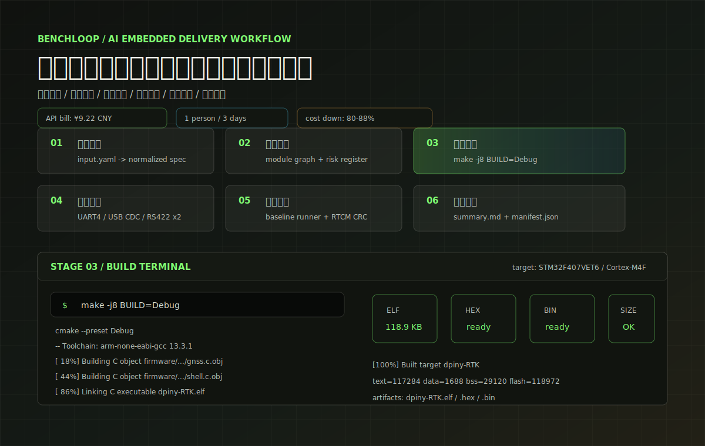
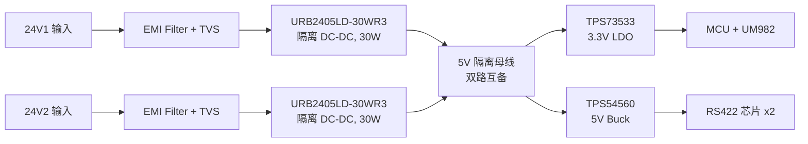
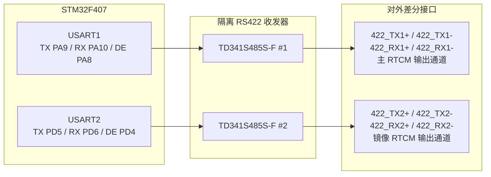
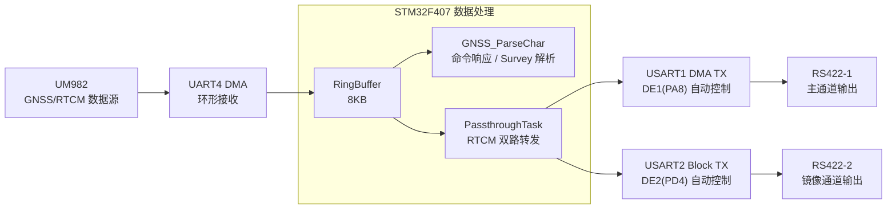
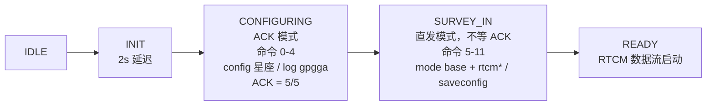
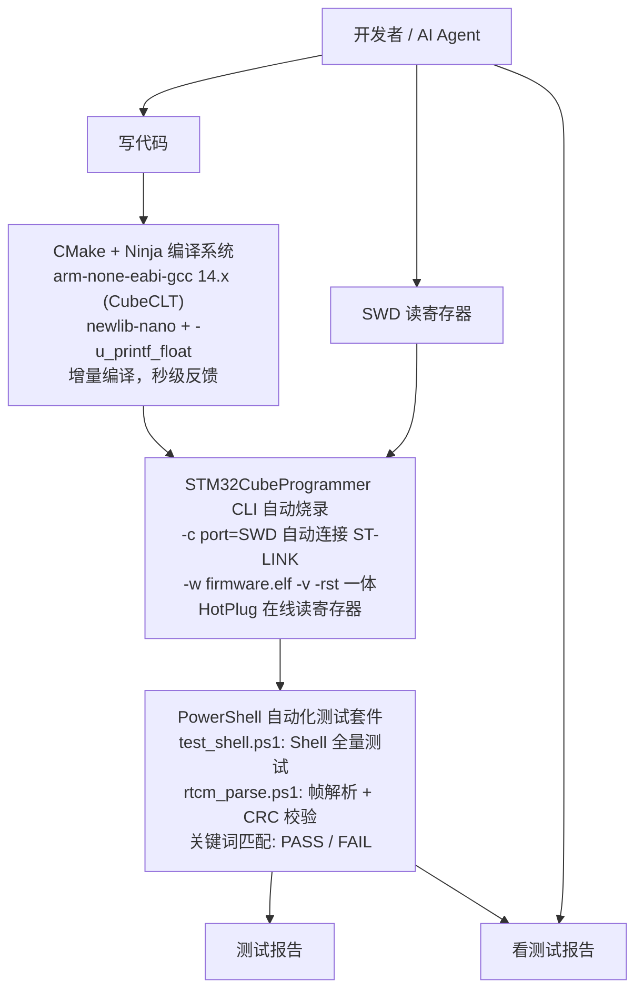

# dpiny-RTK — AI-Native Embedded Delivery Workflow Demo

> Human-in-the-loop AI workflow for embedded firmware delivery.
> 本仓库用 STM32F407 + UM982 RTK 基准站固件作为真实硬件案例，展示从需求拆解、代码修改、CMake 编译、SWD 烧录、串口自动测试、RTCM CRC 校验、寄存器诊断到证据归档的嵌入式交付闭环。

[](https://sailiono.github.io/dpiny-rtk-ai-workflow/)

**交互式项目主页**

- 发布页 Demo: [https://sailiono.github.io/dpiny-rtk-ai-workflow/](https://sailiono.github.io/dpiny-rtk-ai-workflow/)
- Demo 源码目录: [docs/promo-demo/](docs/promo-demo/)

## 30-Second Summary

This repo demonstrates how an embedded team can turn manual firmware delivery into a repeatable loop:

- build firmware from command line;
- flash and verify target over SWD;
- test serial shell automatically;
- validate RTCM stream with CRC gates;
- collect register-level evidence;
- generate handoff package;
- keep AI actions under human review.

这个仓库不是在卖一个 RTK 固件，而是在展示如何把嵌入式研发里的手工步骤变成可复现闭环。**RTK 固件是案例，工作流才是核心产品。**

## What This Repo Demonstrates

This is not only an RTK firmware project.

It demonstrates an AI-assisted embedded delivery loop:

```text
Requirement
  -> Code change
  -> CMake / Ninja build
  -> SWD flash & verify
  -> Serial functional test
  -> RTCM CRC validation
  -> SWD register diagnosis
  -> Evidence package
```

核心价值不是“做了一个 RTK 固件”，而是证明一套可迁移到 STM32 板卡、工控采集设备、传感器网关、飞控外设和通信模块的 **build-flash-test-debug-report** 工作流。

## Why It Matters

传统嵌入式研发经常依赖手动 IDE 编译、手动烧录、手动串口测试、口头故障复盘和不可回放的 bringup 经验。本项目把这些步骤标准化成可审查、可复现、可交接的流程：

- 对老板：降低交付不确定性和对单个老工程师的依赖；
- 对中层：每次改代码都能生成编译、烧录、测试、诊断和 handoff 证据；
- 对工程师：不替换 HAL / FreeRTOS / CMake / CubeCLT，只把重复验证工作包成闭环。

## Start Here

- [Evidence packages](evidence/)：可审计的 public-showcase、真实 bench、远程 HIL 交付证据入口。
- [Real bench evidence](evidence/realrun-redacted-2026-05-20/)：真实硬件运行后的脱敏证据包，覆盖 build / flash / shell / RTCM / USB CDC reset recovery。
- [Remote HIL evidence](evidence/remote-hil-redacted-2026-05-20/)：远程测试台采集的脱敏 baseline，覆盖远程 build / flash / serial gates / RTCM CRC / USB CDC reset recovery。
- [Remote hardware-in-the-loop flow](docs/remote-hardware-debug-flow.md)：硬件留在测试台，开发侧远程完成 build / flash / test / evidence 闭环的脱敏能力案例。
- [Failure-to-fix case studies](case-studies/)：展示真实工程问题的复盘结构；公开仓库中部分寄存器值为脱敏/示例格式，客户交付需附原始 bench log。
- [Workflow template](workflow-template/)：把现有 STM32 项目接入同类闭环的适配模板。
- [ROI model](docs/roi_model.md)：成本、人天和压缩点的估算方法，而不是一句宣传口号。
- [Commercial use cases](docs/commercial-use-cases.md)：可落地到企业项目的场景。
- [AI agent playbook](ai-agent/)：AI 在嵌入式项目里如何操作、何时必须人审。

Primary baseline runner in the reference project:

```powershell
tools/run_test_baseline.ps1 -BuildPreset Debug -ComPort COM4 -RtcmPort COM6
```

It runs the build/flash/shell/RTCM/register-probe loop and writes a manifest even when a gate fails. Add `-UsbPort COMx` when the target exposes a USB CDC shell and reset recovery should be gated in the same run.

Reusable template entry for another STM32 project:

```powershell
workflow-template/run_workflow.ps1 -Adapter workflow-template/project-adapter.json -Stage all
```

Component runner for shell/config validation:

```powershell
tools/functional_test.ps1 -BuildPreset Debug -ComPort COM4
```

Component runner for read-only SWD register evidence:

```powershell
tools/register_probe.ps1 -Target rcc,gpio,usart -OutputJson evidence-out/register_probe_summary.json
```

## Demo Highlights

- STM32F407 + FreeRTOS real firmware；
- UM982 GNSS / RTK module integration；
- USB CDC + USART debug shell；
- dual RS422 RTCM output；
- CMake + Ninja build；
- STM32CubeProgrammer CLI flash；
- PowerShell serial test scripts；
- RTCM frame parser and CRC checker；
- SWD HotPlug register probe；
- evidence package for handoff。

## Cost And Delivery Evidence

- AI API 账单参考：DeepSeek V4 Pro / Flash 本月消耗约 **¥9.22 CNY**，约 **118.8M tokens**、**441 API requests**。
- 本项目开发与测试：约 **1 人 × 3 天 + ¥10 API 消耗**，按 ¥2,000 / 人天计，合计约 **¥6,010**。
- 纯人工保守估算：固件、接口、脚本、测试、文档和集成闭环约 **15-25 人天**，约 **¥30,000-¥50,000**。
- 粗略收益：周期压缩 **80%+**，人力成本下降约 **80-88%**。具体估算边界见 [ROI model](docs/roi_model.md)。

<div align="center">

**基于 STM32F407 + Unicore UM982 | CMake + CubeCLT 自动化工具链 | Human-in-the-loop AI Workflow**

[](https://www.st.com)
[](https://www.unicorecomm.com)
[](https://www.rtcm.org)
[]()
[]()

</div>

---

## 项目亮点

> **这是一个人审闭环的 AI 嵌入式交付工作流案例**。AI 辅助工程师完成代码修改、日志分析、测试脚本生成和证据归档；关键硬件假设、风险判断、最终代码 review 和交付结论由工程师确认。
> 目标不是替代现有工程体系，而是把"修改 → 编译 → 烧录 → 测试 → 诊断 → 证据归档"变成分钟级、可复现、可审计的工程闭环。

---

## 硬件设计

### 电源架构 — 双路隔离冗余供电

系统支持 **双路 24V 宽压输入**，互为冗余备份。任何一路断电不影响系统运行。



| 电源层级 | 器件 | 规格 | 用途 |
|----------|------|------|------|
| 输入保护 | EMI Filter + TVS | 24V, 双向瞬态抑制 | 浪涌/静电防护 |
| 隔离变换 | URB2405LD-30WR3 ×2 | 24V→5V, 30W, 1500VDC 隔离 | 双路隔离 DC-DC |
| 主降压 | TPS54560BDDAR | 5.5-60V→5V, 5A, Buck | RS422 驱动供电 |
| 精密稳压 | TPS73533QDRBRQ1 | 5V→3.3V, 1A, LDO, 车规级 | MCU + UM982 核心供电 |

### 双路 RS422 差分输出

系统配备 **2 路独立 RS422 差分通道**，采用 Mornsun TD341S485S-F 隔离收发器，
通过 STM32 GPIO 自动控制 DE (Driver Enable) 方向，实现硬件级别的收发切换。



**DE 时序控制**：发送前沿 DE 拉高 → USART 数据发送 → DMA 传输完成中断 → DE 拉低。
双路 DE 由 `PassthroughTask` (Realtime 优先级) 统一管理，确保 μs 级时序精度。

### 核心物料清单 (BOM)

下表为样机/小批量阶段的保守估算，包含较高比例的结构件、线缆、工业接插件与渠道溢价。

| 编号 | 组件 | 型号 | 数量 | 单价 | 说明 |
|------|------|------|------|------|------|
| 1 | 隔离 DC-DC | URB2405LD-30WR3 | 2 | ¥66 | 24V→5V, 30W, 双路冗余 |
| 2 | 5V LDO | TPS73533QDRBRQ1 | 2 | ¥10 | 3.3V 精密稳压, AEC-Q100 |
| 3 | RTK 模组 | Unicore UM982 | 1 | ¥310 | 1408 通道, 全星座, 双 RTK |
| 4 | MCU | STM32F407VET6 | 1 | ¥20 | Cortex-M4, 168MHz |
| 5 | RS422 收发器 | TD341S485S-F | 2 | ¥20 | 隔离, 500kbps |
| 6 | 接插件 | 工业级端子台 | 1 | ¥1000 | 21pin, IP67 防护 |
| 7 | 天线接头 | TNC/SMA 接头 | 1 | ¥400 | GNSS 有源天线接口 |
| 8 | 射频线缆 | 低损耗同轴 | 2 | ¥50 | 天线馈线 |
| 9 | 外壳 | 铝合金壳体 | 3 | ¥1000 | 散热+电磁屏蔽 |
| **总计** | | | | **≈¥5022** | |

批量化后，BOM 的主要降本空间不在 MCU/GNSS/电源芯片，而在结构与连接系统。按定制外壳、集成线束、批量接插件、国产替代与统一采购优化后，量产目标成本可控制在 **¥2000 以内**。

| 模块 | 样机估算 | 批量目标 | 降本原因 |
|------|----------|----------|----------|
| 电源与隔离 | ¥152 | ¥120-160 | DC-DC/LDO 批量采购，外围保护器件合并选型 |
| GNSS + MCU | ¥330 | ¥300-380 | UM982 与 STM32F407 主芯片成本占比稳定，批量议价空间有限 |
| RS422 通道 | ¥40 | ¥35-60 | 隔离收发器批量采购，双通道共用保护与接口设计 |
| 工业接插件 | ¥1000 | ¥150-250 | 从样机端子/航插采购切换为定制线束或批量防水连接器 |
| 射频连接与线缆 | ¥500 | ¥80-150 | SMA/TNC 与低损耗线缆集成采购，减少转接件与冗余线长 |
| 外壳与结构件 | ¥3000 | ¥350-550 | 样机 CNC/零售壳体改为压铸、型材或批量定制铝壳 |
| PCB/贴装/辅料 | — | ¥150-250 | 批量 PCB、SMT、端子、保护器件、紧固件与测试治具摊销 |
| **批量目标合计** | **≈¥5022** | **≈¥1185-1800** | 目标通过结构件与连接系统降本实现，成熟批量可控制在 ¥2000 内 |

### 外部接口定义

| Pin | 信号 | 类型 | 说明 |
|-----|------|------|------|
| 1-2 | 24V1+ | 电源 | 主电源输入 (双 pin 增强载流) |
| 3-4 | 24V1- | 电源 | 主电源地 |
| 5-6 | 24V2+ | 电源 | 备份电源输入 |
| 7-8 | 24V2- | 电源 | 备份电源地 |
| 9-12 | GND | 信号 | 信号地 (多 pin 降低阻抗) |
| 13-16 | 422_TX1± / RX1± | RS422 | 通道1: 主 RTCM 输出 |
| 17-20 | 422_TX2± / RX2± | RS422 | 通道2: 镜像 RTCM 输出 |
| 21 | GND | 信号 | 信号地 |

### MCU 引脚分配

| GPIO | 功能 | 连接目标 |
|------|------|----------|
| PA0 | UART4_TX | UM982 UART2 (命令发送) |
| PA1 | UART4_RX | UM982 UART2 (数据接收) |
| PA8 | USART1_DE | RS422 通道1 方向控制 |
| PA9 | USART1_TX | RS422 通道1 (RTCM 主输出) |
| PA10 | USART1_RX | RS422 通道1 |
| PA11 | USB_DM | Type-C USB CDC |
| PA12 | USB_DP | Type-C USB CDC |
| PD4 | USART2_DE | RS422 通道2 方向控制 |
| PD5 | USART2_TX | RS422 通道2 (RTCM 镜像) |
| PD6 | USART2_RX | RS422 通道2 |
| PD8 | USART3_TX | 调试终端 |
| PD9 | USART3_RX | 调试终端 |
| PC6 | USART6_TX | UM982 UART1 (预留) |
| PC7 | USART6_RX | UM982 UART1 (预留) |

---

## 软件架构

### 任务模型 (FreeRTOS)

| 任务 | 优先级 | 堆栈 | 周期 | 职责 |
|------|--------|------|------|------|
| PassthroughTask | `osPriorityRealtime` | 2048B | 事件驱动 | UART4 DMA 双缓冲→RingBuf→USART1/2 转发 + DE 控制 + GNSS 解析 |
| DefaultTask | `osPriorityNormal` | 512B | 50ms | UM982 非阻塞状态机初始化 + IWDG 汇总喂狗 |
| ShellTask | `osPriorityLow` | 2048B | 事件驱动 | USB CDC VCP + USART3 双终端命令解析 |

### 数据流



### UM982 初始化 — 两阶段非阻塞状态机



---

## AI 辅助的自动化工具链

这是本项目最具特色的部分。整套工具链设计使得 AI 可以在工程师审核边界内辅助完成
从代码修改、自动化验证到证据归档的闭环。

### 工具链架构



### AI 开发闭环 (实测)

```
  工程师确认需求 → AI 辅助修改 C 代码
       │
       ▼ (5s)
  ninja 增量编译 → 检查 warning/error
       │
       ▼ (3s)
  CubeCLI flash + verify → MCU 复位
       │
       ▼ (3s 等待枚举)
  test_shell.ps1 → 8 条命令全量测试
       │
       ▼ (2s)
  rtcm_parse.ps1 → 15帧 CRC 校验
       │
       ▼
  ✅ 5/5 PASS → 工程师 review → 提交代码
  ❌ FAIL    → 收集日志/寄存器 → AI 分析 → 工程师确认 → 最小修复 → 回归
```

**关键指标**：

| 环节 | 耗时 | 工具 |
|------|------|------|
| 增量编译 | ~5s | CMake + Ninja |
| 烧录验证 | ~3s | STM32CubeProgrammer CLI |
| Shell 全量测试 | ~15s | test_shell.ps1 |
| RTCM 数据验证 | ~10s | rtcm_parse.ps1 |
| **完整闭环** | **< 60s** | **自动化执行 + 人审确认** |

### 远程调试：SWD HotPlug 寄存器探查

得益于 CubeCLT 的 `HotPlug` 模式，AI 可以基于工程师授权采集到的寄存器证据，在**不中断固件运行**的情况下辅助定位问题：

| 能力 | 命令 | 实际用例 (本项目) |
|------|------|-------------------|
| 读取外设寄存器 | `-r32 0x40023840` | 定位 USART2/3 时钟未启用的根因 |
| 检查 CPU 状态 | `-r32 0xE000EDF0` (DHCSR) | 排除 HardFault / 锁死 |
| 验证 GPIO 配置 | `-r32 0x40020C00` (GPIOD_MODER) | 确认 PD5/PD6 为 AF 模式 |
| 读取复位标志 | `-r32 0x40023874` (RCC_CSR) | 排除 IWDG 复位循环 |
| 查看 USB 枚举 | `-r32 0x50000808` (OTG_DSTS) | 确认 FS 枚举成功 |
| 写寄存器修复 | `-w32 0x40023840 0x10160000` | 手动启用 USART2 时钟验证 |

这套能力在本项目的硬件调试中发挥了不可替代的作用 — 
USART2/3 时钟未启用、RS422 DE 引脚控制时序、UM982 初始化超时等关键问题，
均通过 SWD 寄存器探查快速定位并修复。

---

## 快速开始

### 编译与烧录

```bash
# 编译
cd build/Debug && ninja

# 烧录 (SWD, 自动复位)
STM32_Programmer_CLI -c port=SWD -w dpiny-RTK.elf -v -rst
```

### 连接终端

| 接口 | COM 端口 | 波特率 | 说明 |
|------|----------|--------|------|
| USB CDC VCP (Type-C) | COM4 | 115200 8N1 | **需开启 DTR/RTS** |
| USART3 (ST-LINK) | COM11 | 115200 8N1 | 调试终端 |

### 自动化测试

```powershell
# Shell 功能全量测试 (8 命令 × 关键词匹配)
tools/test_shell.ps1 -Port COM4

# RTCM 数据流验证 (帧解析 + CRC 校验 + 消息类型统计)
tools/rtcm_parse.ps1 -Port COM6 -ReadSecs 10
```

### Shell 命令

| 命令 | 说明 |
|------|------|
| `help` | 列出所有命令 |
| `status` | 系统运行状态：透传统计、GNSS、看门狗 |
| `config` | 查看 Flash 配置 |
| `gnss status` | GNSS 详情 + Survey-in 实时进度 |
| `gnss mode survey` | 设为 Survey-in 基站模式 |
| `gnss mode fixed <lat> <lon> <alt>` | 固定坐标基站模式 |
| `gnss restart` | 重新启动 GNSS 初始化 |
| `rtcm list` | 列出当前 RTCM 消息配置 |
| `rtcm add <id> [freq]` | 添加 RTCM 消息 (默认 1Hz) |
| `rtcm remove <id>` | 移除 RTCM 消息 |
| `rtcm freq <id> <freq>` | 修改 RTCM 消息频率 |
| `baud 1 <rate>` | 修改 UART1 / RS422 主通道波特率 |
| `baud 4 <rate>` | 修改 UART4 / GNSS 通信波特率 |
| `save` | 保存配置到 Flash |
| `reset` | 软件复位 MCU |
| `usb` | USB CDC 连接状态 |
| `version` | 固件版本 |

`baud` 支持的波特率：`9600`、`14400`、`19200`、`38400`、`57600`、`115200`、`230400`、`460800`。
修改后需执行 `save` 保存配置，再执行 `reset` 重启 MCU 后生效。

示例：

```text
baud 1 115200
baud 4 460800
save
reset
```

### RTCM 输出规格

默认 RTCM 消息配置（可通过 Shell `rtcm` 命令动态修改）：

| 消息 | 星座 | 默认频率 | 说明 |
|------|------|----------|------|
| MT1005 | — | 1 Hz | 基准站 ECEF 坐标 |
| MT1074 | GPS | 1 Hz | MSM4 伪距+相位+CNR |
| MT1084 | GLONASS | 1 Hz | MSM4 |
| MT1094 | Galileo | 1 Hz | MSM4 |
| MT1124 | BDS | 1 Hz | MSM4 伪距+相位+CNR |

**支持的 RTCM 消息类型**：

| ID | 说明 | ID | 说明 |
|----|------|----|------|
| 1005 | 基准站 ECEF 坐标 | 1074 | GPS MSM4 |
| 1006 | 基准站坐标+天线高 | 1077 | GPS MSM7 |
| 1033 | 天线信息 | 1084 | GLONASS MSM4 |
| 1087 | GLONASS MSM7 | 1094 | Galileo MSM4 |
| 1097 | Galileo MSM7 | 1124 | BDS MSM4 |
| 1127 | BDS MSM7 | | |

**频率参数** (`interval`，单位秒)：

| 值 | 含义 | 值 | 含义 |
|----|------|----|------|
| 0 | 禁用 | 1 | 1 Hz (每秒) |
| 2 | 0.5 Hz | 5 | 0.2 Hz |
| 10 | 0.1 Hz | 20 | 0.05 Hz |

**RTCM 配置示例**：

```
rtcm list                      # 查看当前配置
rtcm add 1077                  # 添加 GPS MSM7 (默认 1Hz)
rtcm remove 1074               # 移除 GPS MSM4
rtcm freq 1005 5               # 基准站坐标改为 0.2Hz
rtcm add 1033 60               # 添加天线信息 (60s 一次)
save                           # 保存到 Flash
reset                          # 重启生效
```

---

## 配置持久化

系统参数保存于 STM32 内部 Flash Sector 7 (0x08060000)，CRC32 校验。

| 字段 | 默认值 | 说明 |
|------|--------|------|
| `uart1_baud` | 115200 | RS422 主通道波特率 |
| `uart4_baud` | 115200 | GNSS 通信波特率 |
| `gnss_mode` | 0 (Survey-in) | 基站工作模式 |
| `fixed_lat/lon/alt` | — | 固定基站坐标 (WGS84) |
| `rtcm_msgs[8]` | 1005/1074/1084/1094/1124 | RTCM 消息列表 (ID+频率)，最多 8 条 |

## 看门狗策略

IWDG 超时 ≈8s。多客户端心跳机制：每个任务定期上报存活，管理器汇总后统一喂狗。
任一任务超 5s 未上报 → 系统复位。

## 资源占用

| 资源 | 占用 | 总量 | 利用率 |
|------|------|------|--------|
| Flash | ~96 KB | 384 KB | 24% |
| RAM | ~47 KB | 128 KB | 36% |
| DMA | 3 通道 | 16 | 19% |

---

## 目录结构

```
dpiny-RTK/
├── Core/Inc/              # 头文件 (config, gnss, passthrough, shell, iwdg)
├── Core/Src/              # 源文件 (main, freertos, shell, passthrough, gnss, config, iwdg)
├── USB_DEVICE/App/        # USB CDC VCP (环缓冲区异步发送)
├── Drivers/               # HAL + CMSIS + IWDG
├── Middlewares/           # FreeRTOS + USB Device Library
├── cmake/                 # STM32CubeMX CMake 集成
├── docs/promo-demo/       # 交互式项目主页
├── evidence/              # baseline 证据包样例
├── case-studies/          # 故障诊断与回归案例
├── workflow-template/     # 可迁移工作流适配模板
├── ai-agent/              # AI Agent 操作约束与 playbook
├── tools/                 # 自动化测试脚本
│   ├── functional_test.ps1 # 构建、烧录、功能验证入口
│   ├── test_shell.ps1      # Shell 全量功能测试
│   ├── rtcm_parse.ps1      # RTCM 3.x 帧解析器
│   └── usb_cdc_reset_test.ps1 # USB CDC reset recovery gate
├── build/Debug/           # 构建输出
├── CMakeLists.txt         # 顶层 CMake
└── README.md
```

---

## 许可证

Copyright (c) 2026 **Clark Cui**. All rights reserved.

---

*本项目采用 AI (Claude Code) + 开发者协同模式，覆盖硬件选型、原理图设计、驱动开发、
Shell 框架搭建、RS422 时序调试、UM982 协议适配、RTCM 数据校验到自动化测试全流程，
是人+AI 全栈嵌入式开发的可复用模板。*
