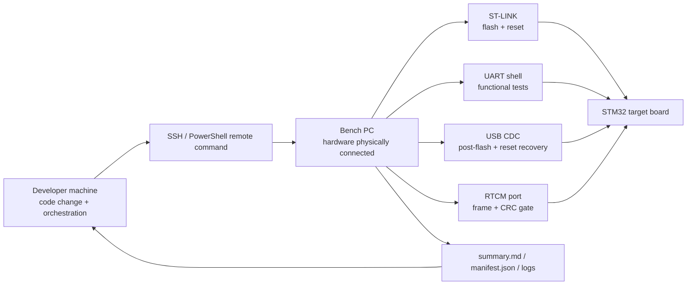

# Remote Hardware-In-The-Loop Debug Flow

This document describes a sanitized capability case: the target board, ST-LINK, USB CDC port, UART shell, and RTCM adapter stay connected to a bench PC, while the developer triggers build, flash, test, and evidence collection remotely.

The public version intentionally removes host names, user names, local IP addresses, private repository paths, SSH key paths, and personal machine paths.

## What It Demonstrates

Traditional embedded debugging often breaks down when the hardware is plugged into someone else's machine:

- the developer waits for screenshots or copied logs;
- COM port and ST-LINK state are described manually;
- each fix requires another manual pull / build / flash / test cycle;
- failure evidence gets scattered across chat, screenshots, and local folders.

This workflow turns the bench PC into a remote hardware execution node:



## Standard Loop

The remote node runs the same local bench scripts that an engineer would run in front of the hardware:

```powershell
tools/run_test_baseline.ps1 `
  -Preset Debug `
  -ComPort <shell-uart> `
  -RtcmPort <rtcm-uart> `
  -UsbPort <usb-cdc> `
  -RtcmReadSecs 10
```

The developer does not need to forward ST-LINK over USB-over-IP. Flash, reset, serial capture, USB CDC recovery, and RTCM parsing all happen on the machine physically connected to the target.

## Evidence Produced

Each run produces:

- `summary.md`: step status, duration, and log references;
- `manifest.json`: branch, commit, ports, options, and result table;
- `logs/02_build.log`: CMake / Ninja / Arm GCC output;
- `logs/03_flash.log`: STM32CubeProgrammer flash and verify transcript;
- `logs/04_functional_test.log`: shell command regression;
- `logs/05_input_validation.log`: invalid command and boundary checks;
- `logs/06_rtcm_parse.log`: RTCM frame count, message types, and CRC result;
- `logs/07_usb_cdc_reset.log`: USB CDC availability before and after software reset.

See the redacted public extract:

- [Real bench evidence 2026-05-20](../evidence/realrun-redacted-2026-05-20/)
- [Remote HIL evidence 2026-05-20](../evidence/remote-hil-redacted-2026-05-20/)
- [USB CDC reset recovery case](../case-studies/04-usb-cdc-reset-recovery.md)

## Case Result

The dpiny-RTK bench run closed three real failure lines:

- USB CDC port existed but the shell was not reliably usable after flash/reset;
- single scripts could pass while the full baseline failed because reset and serial pacing were tighter in the complete workflow;
- RTCM output initially produced CRC failures, then converged to `CRC BAD: 0`.

The final redacted baseline passed:

```text
Dependency check                 PASS
Build firmware                   PASS
Flash firmware                   PASS
USB CDC post-flash availability  PASS
Functional serial test           PASS
Input validation test            PASS
RTCM stream test                 PASS
USB CDC reset recovery test      PASS
```

The latest remote bench extract captured:

```text
Remote baseline time             2026-05-20 10:33:21 +08:00
RTCM bytes                       4593
RTCM frames                      52
CRC OK                           52
CRC BAD                          0
USB CDC reset recovery           PASS
Evidence pullback                summary.md / manifest.json / logs
```

## Why It Matters Commercially

This is valuable for teams whose hardware is scarce, remote, shared, or installed in a lab:

- developers can close firmware issues without moving the device;
- test operators no longer need to manually repeat long command sequences;
- every failed attempt keeps logs rather than disappearing into chat history;
- every successful repair becomes a repeatable regression gate;
- management can review a compact evidence package instead of asking who tested what.

The key message is not "remote access is convenient." The key message is:

> Real hardware debugging can become a reproducible delivery loop: change, build, flash, test, diagnose, archive.
